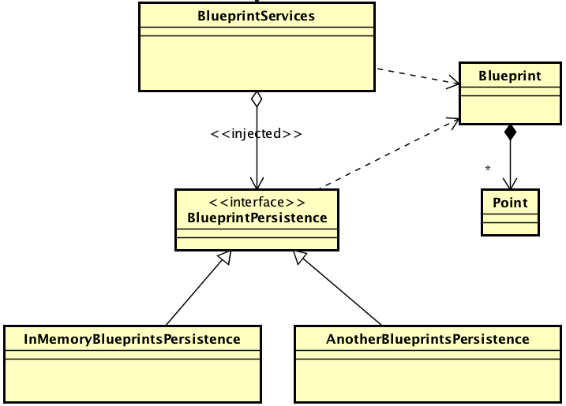

# Arquitecturas de Software (ARSW) - Laboratorio #2

## Componentes y conectores - Parte I.

#### Nicolás Toro

[](https://www.oracle.com/java/)
[](https://maven.apache.org/)

---

#### Middleware- gestión de planos.

En este ejercicio se va a construír un modelo de clases para la capa lógica de una aplicación que permita gestionar planos arquitectónicos de una prestigiosa compañia de diseño. 



1. Configure la aplicación para que funcione bajo un esquema de inyección de dependencias, tal como se muestra en el diagrama anterior.


	Lo anterior requiere:

	* Agregar las dependencias de Spring.
	* Agregar la configuración de Spring.
	* Configurar la aplicación -mediante anotaciones- para que el esquema de persistencia sea inyectado al momento de ser creado el bean 'BlueprintServices'.

Debido a problemas con el desarrollo del mismo laboratorio, se tuvo que actualizar el Spring, por lo que si se requiere
visualizar los cambios hechos, se recomienda revisar el pom.xml que se encuentra dentro de la carpeta laboratorio.


Se agregó la notación @Service en InMemoryBlueprintPersistence para que Spring lo detecte como un bean.


2. Complete las operaciones getBluePrint() y getBlueprintsByAuthor(). Implemente todo lo requerido de las capas inferiores (por ahora, el esquema de persistencia disponible 'InMemoryBlueprintPersistence') agregando las pruebas correspondientes en 'InMemoryPersistenceTest'.


Se agregaron las pruebas unitarias en la clase que se encuentra siguiendo el path:
```bash
cd laboratorio/src/test/java/edu/eci/arsw/blueprints/test/persistence/impl/FilteredTests.java
```


3. Haga un programa en el que cree (mediante Spring) una instancia de BlueprintServices, y rectifique la funcionalidad del mismo: registrar planos, consultar planos, registrar planos específicos, etc.

Se crea el Main y AppConfig.


Dentro de la clase BlueprintsMain, se puede identificar el proceso para comprobar el correcto funcionamiento.

4. Se quiere que las operaciones de consulta de planos realicen un proceso de filtrado, antes de retornar los planos consultados. Dichos filtros lo que buscan es reducir el tamaño de los planos, removiendo datos redundantes o simplemente submuestrando, antes de retornarlos. Ajuste la aplicación (agregando las abstracciones e implementaciones que considere) para que a la clase BlueprintServices se le inyecte uno de dos posibles 'filtros' (o eventuales futuros filtros). No se contempla el uso de más de uno a la vez:
	* (A) Filtrado de redundancias: suprime del plano los puntos consecutivos que sean repetidos.
	* (B) Filtrado de submuestreo: suprime 1 de cada 2 puntos del plano, de manera intercalada.

Se creó un nuevo paquete con el siguiente contenido:


5. Agrege las pruebas correspondientes a cada uno de estos filtros, y pruebe su funcionamiento en el programa de prueba, comprobando que sólo cambiando la posición de las anotaciones -sin cambiar nada más-, el programa retorne los planos filtrados de la manera (A) o de la manera (B). 

Se creó una nueva clase en test para las pruebas unitarias del nuevo paquete creado:


Además, se modificó la clase BlueprintsServices para el correcto funcionamiento del proyecto agregando los filtros.


